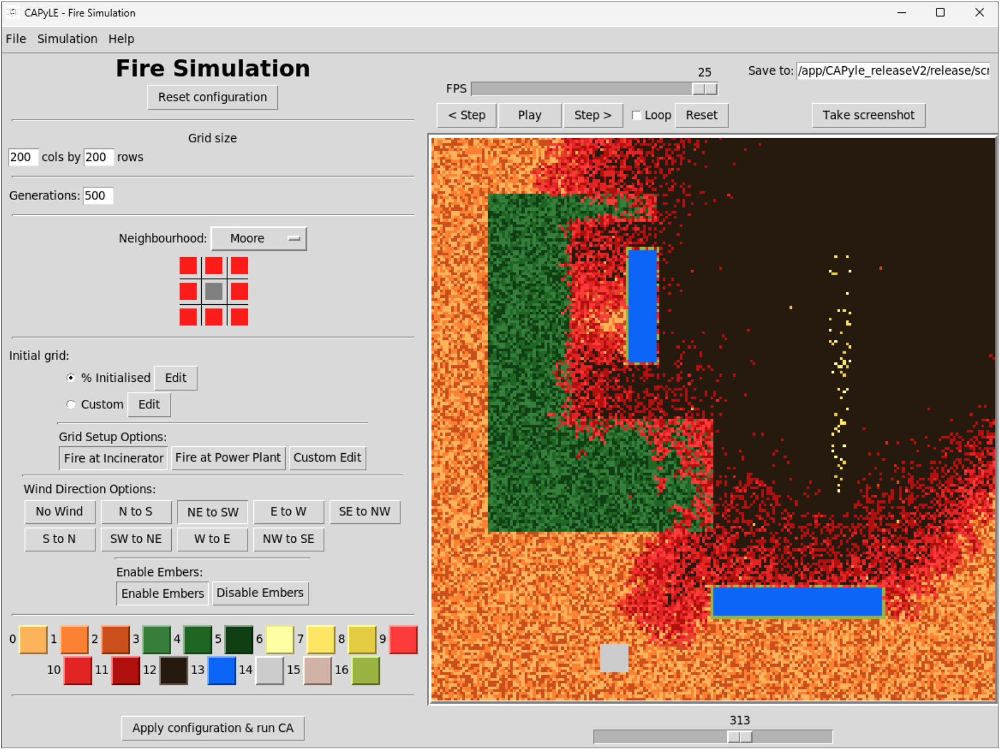

# Cellular Automata Fire Simulation

## Overview
This project is a grid-based cellular automata simulation used to model wildfire spread under varying environmental conditions such as wind, vegetation type, and fuel density. It includes an interactive GUI for configuring and visualising simulations in real time.

## Tech Stack
- Python
- NumPy
- Tkinter
- Matplotlib

## Key Features
- Fire spread simulation influenced by wind direction and fuel density  
- Multiple vegetation types with different burn behaviours  
- Ember-based long-range fire propagation  
- Interactive GUI for configuring and running simulations  

## How to Run

1. Ensure Docker is installed and XLaunch (or an X11 display server) is running.

2. Start the application:
   - Windows / Mac: `docker compose up`
   - Linux: `docker compose -f docker-compose-linux.yml up`

3. In the CAPyLE window:
   - Go to **File → Open**
   - Select `gol_2d_fire.py` and open it

4. Configure and run the simulation:
   - Choose a **Grid Setup Option**
   - (Optional) Adjust wind direction or disable embers
   - Click **Apply configuration and run CA**

5. Press **Play** to start the simulation.